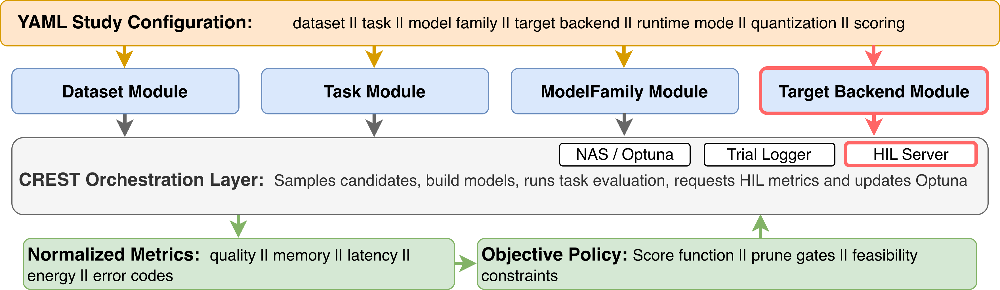
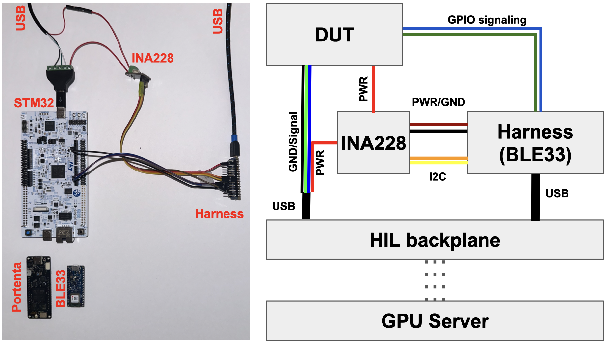

# CREST: Cross-platform Runtime Evaluation and Search Tool

CREST is a deployment-realistic hardware-in-the-loop (HIL) neural architecture
search framework for embedded sensing systems on resource-constrained
microcontrollers. It keeps the optimizer, HIL measurement boundary, logging,
and replay workflow fixed while users vary workload, model family, target
backend, runtime schedule, quantization mode, and selection policy.

CREST currently includes built-in support for OxIOD inertial odometry and
UrbanSound8K prepared-feature audio classification, with target backends for
Arduino Nano 33 BLE Sense, Arduino Portenta H7, and STM32 NUCLEO-N657X0-Q.



## What CREST Provides

- Configurable studies that bind dataset, task, model family, target backend,
  runtime mode, quantization, and scoring policy through YAML.
- Hardware-in-the-loop measurement paths for deployment metrics such as memory,
  latency, energy, cadence telemetry, and status.
- Continuous-inference and cadenced sensing-window runtime modes.
- Search policies for scalar scoring, multi-objective Pareto exploration,
  pruning, and feasibility constraints.
- Replay utilities for remeasuring selected candidates across targets,
  schedules, and policies.
- Analysis scripts for reproducing publication-style plots and claim calculations
  from existing NAS and replay artifacts.

CREST is designed for controlled comparisons. A study can change the board,
runtime schedule, workload, or policy while keeping the search loop, metric
schema, HIL path, and replay machinery consistent. That makes it possible to
ask whether a candidate was selected because of the deployment condition being
tested rather than because a different script or measurement path was used.

## Hardware-in-the-Loop Measurement

CREST separates workload semantics from target-specific deployment mechanics.
The NAS client samples and evaluates candidates, while the HIL server prepares
target-specific artifacts, invokes the selected backend, and returns normalized
metrics to the same scoring and logging path.



For board-level power measurement, the device under test is powered through an
INA228 monitor. A separate harness microcontroller reads INA228 telemetry over
I2C while observing DUT GPIO markers that delimit the measurement window.
Continuous runs mark the repeated inference interval. Cadenced runs mark the
scheduled window that includes active inference and the following sleep or wait
interval.

The HIL harness lets CREST attach each energy value to a concrete candidate,
runtime schedule, and trial outcome without oscilloscope inspection or manual
trace segmentation.

## Choose Your Workflow

1. **Training only**
   **Hardware requirement: no hardware required.** Use this when you want to
   run NAS or training without talking to hardware. For OxIOD, start from
   [src/config/nas_config_flops_rmse.yaml](src/config/nas_config_flops_rmse.yaml)
   or [src/config/nas_config_memory_proxy.yaml](src/config/nas_config_memory_proxy.yaml).
   For UrbanSound8K audio DS-CNN training, use
   [src/config/nas_config_audio_stm32.yaml](src/config/nas_config_audio_stm32.yaml)
   as a template with `device.hil: false` and score/prune terms that do not
   require measured hardware metrics. Read
   [src/config/README.md](src/config/README.md) plus
   [src/README.md](src/README.md) before adapting HIL configs for
   hardware-free runs.

2. **Arduino HIL**
   **Hardware requirement: development board required; HIL harness required for
   harness-assisted or harness-only measurement.** Use this for Arduino
   CLI-backed DUTs and harness-backed measurement flows.
   Start from [src/config/nas_config_ble.yaml](src/config/nas_config_ble.yaml)
   for Nano 33 BLE or
   [src/config/nas_config_portenta.yaml](src/config/nas_config_portenta.yaml)
   for Portenta H7. For the audio DS-CNN path, use
   [src/config/nas_config_audio_portenta.yaml](src/config/nas_config_audio_portenta.yaml).
   Then read
   [src/crest/microcontrollers/README.md](src/crest/microcontrollers/README.md)
   and [sketches/README.md](sketches/README.md).

3. **STM32 HIL**
   **Hardware requirement: NUCLEO-N657X0-Q board required; HIL harness required
   for energy-measured runs.** Use this for the STM32 NUCLEO-N657X0-Q backend.
   Start from
   [src/config/nas_config_stm32.yaml](src/config/nas_config_stm32.yaml), then
   use [src/config/nas_config_audio_stm32.yaml](src/config/nas_config_audio_stm32.yaml)
   for the audio DS-CNN HIL path. Then read
   [src/crest/microcontrollers/README.md](src/crest/microcontrollers/README.md)
   and the committed STM32 workspace notes under
   [sketches/stm32/crest_stm32_lrun/README.md](sketches/stm32/crest_stm32_lrun/README.md).

4. **Analysis scripts / one-off experiments**
   **Hardware requirement: script-dependent.** Use this for focused
   measurement or validation runs outside the main NAS loop. Most analysis
   scripts consume existing artifacts and do not touch hardware; the
   micro-workload probe uses the CREST HIL harness. Start with
   [analysis_scripts/README.md](analysis_scripts/README.md), then open the
   package-specific README for the script family you need.

## Environment Setup

1. **Clone with submodules.**

   ```bash
   git clone --recurse-submodules <url>
   ```

   If you already cloned without submodules:

   ```bash
   git submodule update --init --recursive
   ```

2. **Create and activate the Conda environment.**

   ```bash
   conda env create -f environment.yml -n crest
   conda activate crest
   ```

3. **Install the repo in editable mode.**

   ```bash
   make install
   ```

4. **If you are using GPUs, install the repo-tested TensorFlow CUDA wheel set.**

   ```bash
   pip install --upgrade pip
   pip install tensorflow[and-cuda]==2.20.0
   python -c "import tensorflow as tf; print(tf.config.list_physical_devices('GPU'))"
   ```

   Re-run this step after recreating or replacing the Conda environment. The
   base `environment.yml` installs CPU-usable TensorFlow so CPU-only machines
   do not download CUDA runtime wheels by default; GPU servers need the
   `tensorflow[and-cuda]` extra installed after environment creation. If
   `nvidia-smi` sees GPUs but TensorFlow prints `[]`, this CUDA wheel step is
   usually missing.

If you are CPU-only, the Conda environment already provides the dependencies
needed by the repo.

## Dataset Preparation

For UrbanSound8K audio experiments, prepare the cached log-mel tensors before
running audio training or HIL commands:

```bash
make prepare-audio-dataset
```

Use `URBANSOUND8K_ARGS="--download --accept-license"` when you want the
preparation script to download the dataset through `soundata`, or
`URBANSOUND8K_ARGS="--fold-rotation"` when you also need the fold-rotation
reporting caches.

For OxIOD:

1. Download the OxIOD "Complete Dataset" zip from `http://deepio.cs.ox.ac.uk/`.
2. Rename it to `OxIOD.zip` or pass an explicit path.
3. Prepare the dataset from the repo root:

   ```bash
   make prepare-dataset
   # or:
   make prepare-dataset OXIOD_ZIP=/path/to/OxIOD.zip
   ```

This extracts the dataset into `data/oxiod`, normalizes folder names such as
`slow walking -> slow_walking`, and restores the curated tracked split files
for each activity. Dataset-specific details live in
[data/dataset_download_and_splits/README.md](data/dataset_download_and_splits/README.md).

## Arduino Tooling Setup

All Arduino CLI state is kept inside `tools/` so the repo does not need to
write into `$HOME` or system directories.

1. Ensure `crest` is active.
2. Bootstrap Arduino CLI and repo-local hooks:

   ```bash
   make arduino-setup
   ```

3. Reactivate the environment so the new hooks are loaded:

   ```bash
   conda deactivate
   conda activate crest
   ```

4. Verify the CLI:

   ```bash
   arduino-cli --config-file tools/arduino-cli.yaml version
   ```

5. Install the board package you need. Example for Nano 33 BLE:

   ```bash
   arduino-cli core install arduino:mbed_nano --config-file tools/arduino-cli.yaml
   ```

If Portenta uploads on Linux fail with `LIBUSB_ERROR_ACCESS`, add the udev
rules documented in
[src/crest/microcontrollers/README.md](src/crest/microcontrollers/README.md).

## STM32 Setup

The STM32 flow keeps `STM32CubeCLT` installed outside the repo while cloning
the STM32CubeN6 firmware package into `tools/stm32/STM32CubeN6`.

Run STM32 bootstrap only on the machine that is physically connected to the
STM32 board and will run `python src/hil_server.py`.

Before running the bootstrap, ensure these tools are on your shell `PATH`:

- `ST-LINK_gdbserver`
- `arm-none-eabi-gdb`
- `STM32_Programmer_CLI`
- `arm-none-eabi-gcc`
- `arm-none-eabi-size`
- `arm-none-eabi-objdump`
- `STM32_SigningTool_CLI` or `STM32TrustedPackageCreator_CLI`

For normal STM32 NAS/HIL candidate generation, also ensure `stedgeai` is on
`PATH`. The synthetic micro-workload probe documents its narrower STM32
requirements separately.

Then run:

```bash
make stm32-setup
```

That script validates the toolchain, clones or repairs
`tools/stm32/STM32CubeN6`, checks out the pinned `v1.3.0` baseline, and
refreshes the repo-local STM32 vendor subsets.

## Config Files

The shipped starting points are:

- [src/config/nas_config_stm32.yaml](src/config/nas_config_stm32.yaml)
  STM32-oriented config for the `STM32_NUCLEO_N657X0_Q` backend. This
  is the main starting point for STM32 runs and the most complete commented
  example config in the repo.
- [src/config/nas_config_ble.yaml](src/config/nas_config_ble.yaml)
  BLE-focused starting point for `ARDUINO_NANO_33_BLE_SENSE`.
- [src/config/nas_config_portenta.yaml](src/config/nas_config_portenta.yaml)
  Portenta H7-focused starting point.
- [src/config/nas_config_audio_stm32.yaml](src/config/nas_config_audio_stm32.yaml)
  UrbanSound8K audio DS-CNN starting point for desktop training and
  NUCLEO-N657X0-Q HIL work.
- [src/config/nas_config_audio_portenta.yaml](src/config/nas_config_audio_portenta.yaml)
  UrbanSound8K audio DS-CNN starting point for Arduino-backed Portenta H7 work.

The highest-signal fields for a first pass are:

- `device.*`
  Target selection, HIL enable/disable, serial ports, runtime mode, and
  backend-specific nested options.
- `dataset.*`
  Dataset adapter selection and dataset-local paths/parameters, including
  OxIOD windowing or UrbanSound8K cache locations.
- `training.*`
  NAS epochs/trials, full-training epochs, quantization, and the runtime-side
  `energy_aware` / `input_mode` switches.
- `nas.*`
  Score and prune configuration.
- `dataset`, `task`, `model`
  Modular component selection blocks when you want to override the built-in
  defaults explicitly.

For the full config reference, score/prune schema, and current runtime caveats,
see [src/config/README.md](src/config/README.md).

## Running NAS And HIL

CREST runs a NAS/training client on a training host and talks to the HIL server
running on the board-connected device host.

### 1. Start the HIL server on the device host

```bash
cd /path/to/CREST
conda activate crest
python src/hil_server.py
```

For STM32, complete the STM32 setup section above on the board-connected host
before starting the HIL server.

### 2. Open a reverse SSH tunnel from the device host to the training host

```bash
ssh -R "6001:127.0.0.1:6001" <gpu_server>
```

The default configs expect the HIL server at `127.0.0.1:6001`. If the NAS
client and HIL server run on the same machine, the reverse SSH tunnel is not
needed.

### 3. Run the NAS client on the training host

```bash
cd /path/to/CREST
conda activate crest

# Quick smoke pass
python3 src/nas_model_client.py --smoke-test 3 --study-name smoke_run

# Full NAS run
python3 src/nas_model_client.py --study-name crest_run
```

Useful flags:

- `--config /path/to/config.yaml`
- `--smoke-test N`
- `--study-name NAME`

### 4. Outputs

Artifacts are written under the configured `outputs.models_dir` and
`outputs.candidate_dir`. Typical outputs include:

- `models/<study_name>/optuna.db`
- `models/<study_name>/trials.csv`
- `models/<study_name>/train_history.json`
- `models/<study_name>/summary.json`
- generated TFLite and `.keras` artifacts

## Reproducing Case-Study Analyses

Case-study run configs live in
[src/config/case_study_configs/](src/config/case_study_configs/). They cover:

- Case Study 1: OxIOD/TCN proxy-vs-measured-energy selection across targets.
- Case Study 2: STM32/OxIOD continuous-vs-cadenced schedule comparison.
- Case Study 3: UrbanSound8K/DS-CNN application-level scoring on two targets.

Plotting and calculation utilities live under [analysis_scripts/](analysis_scripts/).
Those scripts consume existing NAS and replay artifacts; they do not rerun NAS
or touch hardware unless their package README says so.

## Documentation Map

- [src/README.md](src/README.md)
  Source architecture, shared abstractions, trial logging, replay, and
  extension paths.
- [src/config/README.md](src/config/README.md)
  Full config reference and scoring/pruning semantics.
- [src/config/case_study_configs/README.md](src/config/case_study_configs/README.md)
  Case-study config index.
- [src/crest/datasets/README.md](src/crest/datasets/README.md)
  Dataset adapter contributor guide.
- [src/crest/tasks/README.md](src/crest/tasks/README.md)
  Task adapter contributor guide.
- [src/crest/microcontrollers/README.md](src/crest/microcontrollers/README.md)
  Backend contracts, bring-up, staging, compile, upload, and runtime flows.
- [src/crest/model_families/README.md](src/crest/model_families/README.md)
  Model-family extension guide.
- [sketches/README.md](sketches/README.md)
  Shared Arduino sketch and STM32 workspace layout.
- [analysis_scripts/README.md](analysis_scripts/README.md)
  Analysis and validation utilities.
- [data/dataset_download_and_splits/README.md](data/dataset_download_and_splits/README.md)
  OxIOD preparation plus UrbanSound8K audio cache preparation.

## Troubleshooting

- If training-only runs should not touch hardware, start from a desktop-safe
  config or set `device.hil: false` and remove score/prune terms that require
  measured hardware metrics.
- If Arduino uploads fail on Linux with `LIBUSB_ERROR_ACCESS`, apply the udev
  rules documented in the MCU README.
- If STM32 bootstrap, HIL startup, or candidate generation fails, re-check the
  STM32 setup section above, then consult the MCU README for backend-specific
  diagnostics.
- If OxIOD preparation fails, confirm the zip exists and that the repo still
  contains the tracked split templates under `data/oxiod/<activity>/`.
- If audio runs fail while loading data, run `make prepare-audio-dataset` and
  confirm the UrbanSound8K cache path in the selected config exists.

## Anonymous Review Note

Citation, acknowledgments, and identifying project metadata are intentionally
omitted from this README while the artifact is prepared for double-blind
review. They can be added back for a public release.
