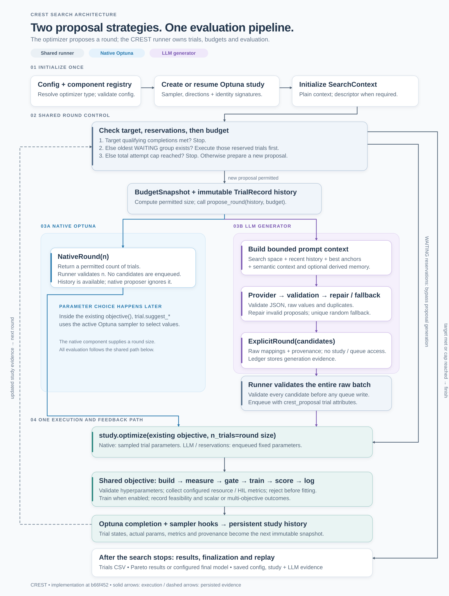

# CREST optimizer system: proposals, shared evaluation, and trustworthy evidence

This guide describes the implementation at `b66f452`. CREST searches for models that work under a concrete deployment contract: a workload and task, a model family, a target device, a runtime schedule, and a scoring and feasibility policy. The optimizer chooses experiments within that contract. CREST retains responsibility for building, measuring, training, evaluating, and recording them.



Diagram downloads: [PNG](assets/optimizer_flow.png) · [editable Mermaid source](assets/optimizer_flow.mmd).

## Why this boundary exists

Embedded model search involves more than architecture. Quantization, CPU clock, inference cadence, memory limits, and short training schedules can change what a result means. Different workloads, models, devices, schedules, and proposal algorithms should remain understandable experiments. AI-generated candidates especially need comparable evidence: an attractive explanation from a provider is not a deployment measurement or a trained-model result.

The implemented boundary keeps one evaluation path and one authoritative trial store. A proposer supplies either a request for native sampling or an ordered set of exact raw parameters. It cannot quietly change training, bypass hardware gates, or redefine score evaluation. This makes proposal methods easier to compare while preserving the experiment configuration that gives their results meaning.

The design deliberately reuses CREST's existing components, model-family sampling, Optuna studies, objective, logging, and replay code. There is no second LLM execution engine, result database, or custom trial-state machine. A small contract is easier to extend and inspect than duplicated evaluation loops.

## Optuna remains the engine and store in both modes

`optimizer.type: optuna` selects the native proposer. `optimizer.type: llm_generator` selects the LLM proposer. In either case, the runner opens an Optuna study, builds its sampler, and calls `study.optimize(self.objective, n_trials=...)`.

| Responsibility | Owner |
| --- | --- |
| Choose a native round or explicit candidates | Registered optimizer component |
| Select native parameter values | Optuna sampler through `trial.suggest_*` |
| Validate every explicit candidate and enqueue it | `NASModelClient` runner |
| Build, measure, gate, train, evaluate, and score | Shared `objective` and existing components |
| Persist trial numbers, sampled parameters, values, states, and attributes | Optuna study/storage |
| Record LLM prompts, responses, repair, fallback, and derived memory | LLM component's ledger |

The LLM supplies fixed values to Optuna's queue. The same `suggest_*` calls then consume those values inside the objective. Native rounds enqueue nothing; the sampler chooses values when those calls execute. The sampler still exists in LLM mode, including its completion-time constraint handling, but it does not choose fields in a valid complete explicit proposal.

Native scalar search uses `TPESampler(n_startup_trials=15, multivariate=True)`. Native multi-objective search uses `NSGAIISampler(population_size=training.nas_multiobjective_population_size, seed=42)`. Enabled feasibility adds `constraints_func` to either sampler. Scalar TPE has no explicit seed in this setup. Execution is sequential: native sampling can use feedback from each preceding trial within a round. An LLM batch is proposed together, so its next proposal call sees feedback after that batch executes.

## The proposal contract

An optimizer implements [`OptimizerABC`](src/crest/interfaces.py). The registry stores classes, constructs the selected class with no arguments, validates its normalized optimizer block, and initializes it once before execution. Registration and config validation do not resolve provider credentials or create clients.

The component hooks are:

```text
validate_config(config)                  # optional local validation
identity_config(config) -> dict          # deterministic proposal settings
initialize(context, config)              # optional runtime setup
propose_round(history, budget) -> NativeRound | ExplicitRound
```

`propose_round` is the required method. Components receive no `Study`, `Trial`, NAS client, live dataset bundle, or hardware connection. They must not enqueue candidates, evaluate them, or mutate trial evidence.

The passive payloads live in [`pipeline_types.py`](src/crest/pipeline_types.py):

| Payload | Meaning |
| --- | --- |
| `SearchContext` | Study/artifact location, ordered objective names and directions, serialized score configuration, optional raw search descriptor, stable semantic context, model-family name, and feasibility-enabled flag |
| `TrialRecord` | Stable trial number, neutral state name, actual sampled `params`, values, user attributes, and system attributes |
| `BudgetSnapshot` | Existing attempted count, completed-target count, total target, total cap, and permitted size of this fresh round |
| `NativeRound(n_trials)` | Request native sampling for a positive integer count within the allowance |
| `ExplicitRound(candidates)` | Nonempty ordered tuple of `CandidateProposal(params, provenance)`; its count is derived from tuple length |

The runner supplies a fresh history snapshot on every proposal call, including after restart. Nested mappings and sequences in history and semantic context are detached and frozen. A stateful proposer can track processed trial numbers internally; there is no separate `observe` or restore-history API. WAITING trials may have empty sampled `params`; their intended proposal values must not be presented as measured or sampled history.

Two capability hooks control setup. Explicit plugins default to `requires_search_space = True` and `requires_semantic_context(config) == True`. Native Optuna opts out of both: it never calls descriptor or semantic-context construction, preserving families with existing define-by-run sampling. LLM requires a descriptor. Setting `optimizer.llm.semantic_context: false` skips semantic construction while retaining the raw descriptor and a disabled semantic record in prompts. An invalid declared descriptor propagates as an error; it is not treated as missing optional support.

## Exact raw parameters, then shared evaluation

The family declares its raw search surface through `trial_search_space`, using [`SearchParam` and `SearchSpaceDescriptor`](src/crest/search_space.py). The runner adds `quantization_mode` only when quantization search and the deployment path are active; it adds `cpu_clock_mhz_index` only when compile-derived metrics are collected and clock options are configured. These conditions match the objective.

Explicit candidates must contain exactly every active raw field with legal types, finite numeric values, inclusive bounds, or declared categorical choices. For example, supply `dilations_index` and `cpu_clock_mhz_index`, rather than decoded dilation lists or MHz values. All members and their JSON-safe provenance are validated before any member is enqueued. This prevents a missing field from silently becoming a native-sampler choice credited to the proposer.

Shared validation permits deliberate repeated experiments. Duplicate filtering belongs to the proposer. Queue mutation itself is not transactional: if enqueue fails partway, already reserved trials remain and are drained on restart.

The runner writes namespaced `crest_proposal` user attributes, including the resolved optimizer name, `round_id`, batch index, intended `proposal_params`, and source metadata. It keeps these separate from actual `trial.params` and decoded family hyperparameters. A build failure can occur before deployment fields are sampled; provenance then describes intent while `params` truthfully describes the fields actually consumed.

Every executed candidate follows the existing objective:

1. Sample and decode family hyperparameters; validate them; build the model; validate task outputs and compile through the task.
2. Count FLOPs, resolve quantization, estimate static memory, and assemble runtime metadata. Resolve a clock index separately from architecture when that runtime search is active.
3. Request compile/HIL metrics when required by the active policy, or synthesize the desktop success payload. Compile-derived collection and physical HIL execution are separate decisions.
4. Check returned HIL status, flash/RAM limits, and applicable tensor-arena validity. Apply configured post-build, pre-fit prune rules, then feasibility rules.
5. When training is enabled, use the task's search fit plan, inject `nas_epochs` and batch size 256, train, reload the checkpoint, evaluate validation predictions through TFLite, and record companion Keras metrics. When training is disabled, supply task metric sentinels and evaluate the configured non-training score.
6. Validate objective values; log the outcome and evidence; return a scalar or ordered objective tuple. Optuna records terminal state and invokes sampler completion processing, including persisted feasibility constraints.

`training.train: false` is supported when the score and policy do not require unavailable training metrics. Use a score based solely on available static or compile metrics, such as FLOPs, rather than merely disabling training in an accuracy-dependent score.

## Rejection, feasibility, and aborts mean different things

Do not interpret `COMPLETE` as proof that a model was trained successfully or was feasible.

| Event | Scalar study | Multi-objective study |
| --- | --- | --- |
| Returned HIL failure, resource/arena failure, configured prune hit, or handled invalid evaluation metrics | Log `pruned=True`, report `-inf` at step 0, raise `TrialPruned` | Log `pruned=True`, return direction-aware penalties; Optuna records `COMPLETE` |
| Infeasible candidate with `train_if_infeasible: false` | Skip fit and return scalar penalty `-100`; `COMPLETE` | Skip fit and return direction-aware penalty tuple; `COMPLETE` |
| Infeasible candidate with `train_if_infeasible: true` | Continue training/scoring; retain infeasible status | Continue training/scoring; retain infeasible status |
| Device not found or uncaught build/runtime/training exception | Exception aborts the run | Exception aborts the run |

Multi-objective penalties are `1e12` for minimized objectives and `-1e12` for maximized objectives. A returned fatal HIL status uses the candidate rejection path; a transport/runtime exception can propagate and stop the campaign. No new optimizer-specific abort policy is introduced.

Feasibility constraints are persisted in trial attributes. The sampler callback reads that evidence rather than re-evaluating old measurements against the current config. Pre-fit failures carry `not_evaluated` feasibility and positive constraint sentinels. Feasibility signatures separately guard policy compatibility on resume.

## How the LLM chooses candidates

[`LLMGeneratorOptimizer`](src/crest/optimizers/llm/component.py) owns provider setup, prompt construction, local validation, repair, fallback, and experimental memory. Its provider-neutral prompt combines the active raw descriptor and objective summary with budget counters and four different evidence views:

- **Recent trials:** the newest configured window, including state and useful failure/measurement information.
- **Anchors:** the best eligible scalar candidates, or a bounded feasible Pareto representation near the two-objective knee. Degenerate or higher-dimensional fronts use a normalized ideal-point compromise; stable trial numbers break ties.
- **Accumulated memory:** structured findings derived from older terminal evidence, with conditions, measurements, exceptions, uncertainty, and cited trial numbers.
- **Pending trials:** unsummarized terminal evidence outside the recent window, so summary delay does not make it invisible.

Repeated references to a trial across these views represent one observation. Semantic context supplies bounded workload/task/model/device/runtime explanations and parameter priors, with a version and hash. It distinguishes registered device capacities from available application or tensor-arena budgets. Priors and memory are fallible guidance; neither changes the legal search space or measured evidence.

The prompt phase is deterministic from attempted trials divided by the total cap: exploration below 35%, specification below 85%, and finalization thereafter. These are proposal instructions, not changes to the objective or final-training procedure.

Memory defaults to starting after 10 terminal trials and updating every 5, with at most 12 findings, 6000 characters, and 100 pending trials. Valid updates retain untouched findings, explicitly replace existing IDs, and retire findings only with a reason. State records coverage hashes and snapshots. Restored memory must match its context and covered trial evidence. Failed summaries retain prior state and pending evidence; excessive backlog stops explicitly instead of silently discarding observations.

The provider must return `{"candidates": [{...}]}`. LLM validation checks the envelope, count, exact raw fields, and duplicates. Duplicate detection uses descriptor-complete `COMPLETE` parameters and earlier accepted candidates in the batch, including penalized COMPLETE trials; PRUNED and FAIL trials are outside that completed set. Descriptor-complete actual WAITING parameters, when present, are also checked for queued duplicates. Anchors apply stricter success/feasibility filters and exclude penalized failures. WAITING sampled parameters are not reconstructed from queue metadata.

A partially accepted batch runs at its accepted size without filling rejected slots. A batch with zero accepted candidates gets up to `max_repair_attempts` additional calls after the initial call. Provider errors, invalid JSON, and validation errors contribute repair feedback. After exhaustion, the component tries up to 100 locally sampled candidates and returns one legal unique random fallback. Failure to find one raises an error. `random_seed` controls this local RNG, not remote provider randomness.

## Budgeting and restart behavior

Production targets and caps are totals for the study, not additional work requested by this invocation:

```text
T = training.nas_trials
A = len(study.trials)                 # includes WAITING and RUNNING
C = qualifying COMPLETE trials
M = max(training.max_total_trials, A at study open)
needed = T - C
remaining = M - A
scalar allowance = min(needed, remaining)
multi allowance = min(max(needed, population_size), remaining)
```

With feasibility rules, `C` counts only COMPLETE trials marked `feasible`. Without them, it counts every COMPLETE trial, including multi-objective penalty completions. Failed, pruned, infeasible, RUNNING, and reserved WAITING trials consume the attempt cap. The LLM caps the fresh allowance by its configured `batch_size`; accepted count determines actual execution size.

At each production boundary, the runner first stops if the completion target is satisfied, leaving any WAITING work untouched. Otherwise it consumes the oldest contiguous WAITING group before checking the cap for new proposals. Tagged groups use `crest_proposal.round_id`; untagged entries are consumed deterministically without inventing provenance. `n_trials` equals the selected group's waiting remainder, preventing execution from spilling into new native samples.

WAITING trials already reserve attempts, so draining them remains possible when reservations have reached the cap. Target and cap are rechecked between rounds, not midway through an ordinary group. Multi-objective population sizing can therefore exceed the remaining completion need. Orphan RUNNING trials still consume attempts; the runner does not recover them automatically. Concurrent writers and exactly-once physical measurement are outside this serial runner's guarantees.

Smoke testing differs: `smoke_test(trials=N)` executes exactly N additional attempts, including consumed waiting work, rather than retrying until N successful completions. It uses per-study `optuna_smoke_test.db`, appends on repeated calls, and restores temporary training/HIL/epoch/budget settings afterward. It uses the same selection, proposal, queue, and objective path.

## Configure and extend an experiment

The following YAML blocks are **merge snippets**, not complete runnable configurations. Start from an appropriate file in [`src/config`](src/config/README.md), retaining its dataset, task, model, device, score, and output settings.

```yaml
optimizer:
  type: optuna
training:
  nas_trials: 50
  max_total_trials: 80
```

An LLM snippet using the implemented OpenAI-compatible transport:

```yaml
optimizer:
  type: llm_generator
  llm:
    provider: openrouter
    model: your-provider-model-id
    api_key_env: OPENROUTER_API_KEY
    batch_size: 5
    max_repair_attempts: 1
    random_seed: 0
    recent_trial_window: 10
    anchor_count: 5
    semantic_context: true
    memory:
      enabled: true
```

OpenRouter defaults its base URL and JSON response mode. Generic `openai_compatible` providers require an explicit clean `base_url`, `model`, and `api_key_env`; the transport appends `/chat/completions`. URL userinfo, query parameters, and fragments are rejected. Credentials are read at runtime. A `fake` provider with configured response fixtures supports local checks without paid calls.

Each study stores a versioned optimizer signature: resolved registration name, deterministic non-secret `identity_config`, and effective sampler class/options. LLM identity includes provider/model, generation settings, prompt/schema/context/memory versions, history/anchor/memory settings, and fallback policy. Credentials, output paths, and completion/attempt budgets are excluded. Known older private TPE/NSGA-II class paths compare through exact public-name aliases; options and remaining identity stay strict.

To extend a signed campaign, keep the study name, database, and original scientific configuration, then raise the total target and cap. For example, raising 250 completions to 300 requests progress toward 300 total. A matching signed native or LLM study resumes before new proposals. A signature mismatch fails before initialization or queued execution.

**This signature is not a fingerprint of the whole scientific experiment.** It does not certify unchanged dataset, model, training, device, or score settings. Retain and compare the original experiment configuration yourself; budget-only extension is the supported use.

Migration of unsigned LLM studies is unsupported; existing signed LLM campaigns extend normally when identity matches. Nonempty unsigned studies fail by default. Native-only `optimizer.adopt_legacy_study: true` is a one-time attestation that the active configuration matches the original native experiment. It rejects WAITING trials, explicit-proposer attributes, any `fixed_params` system-attribute key even when empty, and an existing per-study `llm_optimizer` artifact path. It also checks ordered study directions, feasibility signatures, and required COMPLETE feasibility evidence before stamping identity. It preserves trial evidence and does not recover RUNNING work. Remove the flag after adoption. These checks are conservative counterevidence guards, not proof of native provenance; unsigned LLM/plugin adoption and optimizer switching within a campaign are unsupported.

## Add a simple proposer

Register a class before `load_config()` so custom fields survive normalization and validation. Custom names are case-sensitive after whitespace stripping; historical built-in names accept case aliases only when no exact registration exists. This example deliberately repeats a fixed experiment and imports no Optuna API:

```python
from collections.abc import Mapping
from crest.interfaces import OptimizerABC
from crest.pipeline_types import CandidateProposal, ExplicitRound
from crest.registry import optimizer_registry
from crest.search_space import validate_candidate
from crest.model import load_config

class FixedCandidate(OptimizerABC):
    def validate_config(self, config):
        if not isinstance(config.get("candidate"), Mapping):
            raise ValueError("optimizer.candidate must be a mapping")

    def identity_config(self, config):
        return {"candidate": dict(config["candidate"])}

    def requires_semantic_context(self, config):
        return False

    def initialize(self, context, config):
        self.params = dict(config["candidate"])
        validate_candidate(self.params, context.search_space)

    def propose_round(self, history, budget):
        return ExplicitRound((CandidateProposal(self.params),))

optimizer_registry.register("fixed_candidate", FixedCandidate)
config = load_config("experiment.yaml")
```

Supply `optimizer.type: fixed_candidate` and an `optimizer.candidate` mapping containing every active descriptor field for your chosen family and runtime. The example returns one trial per call and needs no `llm` block. Use the usual runner after registration. Configurable plugins must include every proposal-affecting setting in JSON-safe `identity_config`; default `{}` is appropriate only when there are no such settings. Explicit plugins retain the descriptor requirement. A proposer returning native rounds can opt out through the capability hooks.

## Inspect results, finalize, and replay

The per-study artifact directory is `outputs.models_dir/<study_name>/`. Optuna storage contains the authoritative state and provenance. The configured trial CSV records measurements, objective outcomes, task metrics, and rejection/feasibility evidence through existing `log_trial`; it does not gain dedicated `crest_proposal` columns. `trials.csv` exports the Optuna dataframe, including parameter and attribute columns. Inspect both state and eligibility evidence when interpreting results.

LLM artifacts under `llm_optimizer/` include numbered request/response JSON pairs, `prompt_contexts.jsonl`, `returned_candidates.jsonl`, `rejected_candidates.jsonl`, `optimizer_events.jsonl`, and memory state/snapshots. Responses retain raw output and available usage, finish reason, and latency. `returned_to_runner` means a proposal passed component validation and was returned; it does not prove queue acceptance or execution. Study trial attributes establish queue acceptance. Older `accepted_candidates.jsonl` and `batch_enqueued` artifacts retain their historical meanings.

Scalar `run_scoring_nas` selects a feasible completed trial when feasibility is enabled, retrains it on the longer schedule, evaluates held-out test data, exports TFLite, and writes training plots, task closeout artifacts, and a summary; optional fold rotation follows the fixed-split closeout. Without feasibility, selection uses Optuna's best scalar trial. Multi-objective closeout exports the Pareto CSV and returns without automatic final retraining. Existing family decoding and Pareto replay continue using actual raw parameters; runtime choices are handled separately, and proposal metadata stays in attributes.

## Implementation and validation map

| Read this source | For |
| --- | --- |
| [`interfaces.py`](src/crest/interfaces.py), [`pipeline_types.py`](src/crest/pipeline_types.py), [`registry.py`](src/crest/registry.py) | Public contract and passive payloads |
| [`component_selection.py`](src/crest/component_selection.py), [`builtin_components.py`](src/crest/builtin_components.py), [`model.py`](src/crest/model.py) | Selection, lazy registration, configuration, scoring, and logging |
| [`nas_model_client.py`](src/nas_model_client.py) | Sampler/signature setup, capability initialization, reservation draining, round execution, objective, smoke, budgets, and finalization |
| [`search_space.py`](src/crest/search_space.py), [`optimizer_history.py`](src/crest/optimizer_history.py), [`semantic_context.py`](src/crest/semantic_context.py) | Raw legality, immutable snapshots, and stable explanatory context |
| [`optuna.py`](src/crest/optimizers/optuna.py), [`LLM component`](src/crest/optimizers/llm/component.py), [`generation`](src/crest/optimizers/llm/enqueue.py) | Native request and LLM proposal ownership |
| [`history.py`](src/crest/optimizers/llm/history.py), [`memory.py`](src/crest/optimizers/llm/memory.py), [`prompt_builder.py`](src/crest/optimizers/llm/prompt_builder.py), [`provider.py`](src/crest/optimizers/llm/provider.py), [`ledger.py`](src/crest/optimizers/llm/ledger.py) | Evidence selection, summaries, prompt/transport, and audit artifacts |
| [`pareto_replay.py`](src/crest/pareto_replay.py) | Existing candidate replay |

Contract, context, runner, resume, and LLM regression tests cover custom registration, legal raw fields, immutable evidence, partial acceptance, real Optuna reservations, partial-enqueue restart, budget extensions, strict identity mismatches, legacy adoption counterevidence, scalar/multi-objective rejection, and fixed-candidate objective parity. A regression explicitly verifies that a rejected first candidate never trains and a subsequent viable candidate trains once while both consume attempts.

The recorded full suite passed **790 tests and 203 subtests, with one skip**; see [`claude_review_disposition.md`](claude_review_disposition.md). This is local regression evidence. Paid provider behavior, physical hardware campaigns, and final hardware/provider performance were not validated by that run. The contract does not support arbitrary dynamic explicit spaces, streaming proposal feedback, different execution semantics, automatic stale-trial recovery, or identical stochastic trajectories across proposers.
